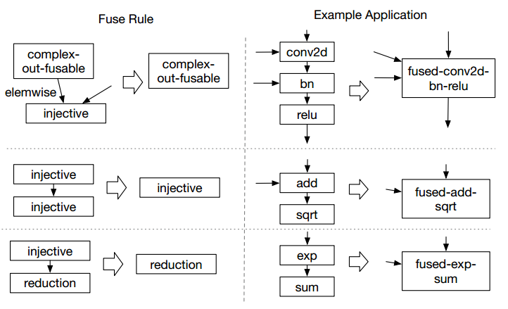

## Overview

- TVM 架构

<div align="center"></div>

- TVM api的使用
  ```python
  import tvm as t
  import tvm.runtime as tr

  graph, param = t.frontend.from_keras(keras model)
  target = t.target.cuda()

  # graph: the final optimized computational graph
  # lib: generated operators 
  # params:module parameters
  graph, lib, params = t.compiler.build(graph, target, params)

  module = runtime.create(graph, lib, tr.cuda(0))
  module.set_input(**params)
  module.run(data=data_array)
  output = t.nd.empty(out_shape, ctx=tr.cuda(0))
  module.get_output(0, output)
  ```

## 计算图优化

high-level的计算图表示和low-level的IR的主要区别为计算图的中间数据是多维Tensor，计算图提供了对`Op`的宏观调用流程表示，但是没有指定每个 `Op`具体的实施方式。和LLVM一样，计算图被转换成等价图来进行优化，在此基础上，TVM利用了DL中的形状特性来对固定输入进行优化。

### 算子融合

即将多个`Op`结合在同一个kernel中以此减少中间结果存储开销，该优化可以减少执行时间。文章将Operators分为四类：

- injective：一一映射, e.g., Add
- reduction：输入到输出降维，e.g., Sum
- complex-out-fusable：可以和element-wise算子融合的复杂操作，e.g., Conv2d
- opaque：无法融合的算子，e.g., sort

文章给出了三种算子融合规则，如下图所示：

<div align="center"></div>

具体来说，图中对应的规则依次为：
1. element-wise类型算子（即injective)可以被融合到complex-out-fusable的output端
2. 多个injective算子可以被融合为另一个injective算子
3. reduction算子可以与injective算子的input端融合

### 其它优化

- **数据布局转换**：为了在目标硬件上执行，该优化将计算图转换成一个能更好利用内部数据布局的图。首先根据内存层次结构给定首选数据布局，如果出现生产者消费者首选结构之间不匹配，会再进行适当转换。
- **常量折叠**：通过提前计算静态部分减少执行时间
- **静态内存规划**：提前分配用于存放中间结果的内存

## 生成张量运算

TVM通过生成大量实现并从中选择优化实现的方式产生高效代码，该方法基于Halide的将描述和计算规则分离的思想，并添加了新的优化扩展与硬件后端支持。TVM特性如下：

### Tensor表达式

TVM引入了新的张量表达语言来支持自动代码生成。与不透明的high-level计算图表示不同，每个操作都会指明输出的形状与算符运算方式。一个矩阵乘法的例子如下：

<div align="center"></div>

根据Halide的思想，使用一个schedule指明从tensor表达式到low-level代码的映射。TVM通过增量应用保证逻辑等价的基本转换来构建schedule。在内部，通过特定数据结构跟踪loop结构信息与schedule转换等其他信息。

整个转换过程可以用下图表示：

<div align="center"></div>


以1024\*1024的矩阵乘为例，TVM表达式与其对应vanilla low-level code如下：
<div align="center"></div>

经过Tiling切分成8\*8的矩阵后，其low-level code如下：

<div align="center"></div>

将内层8\*8的矩阵乘法map到优化过的张量指令`gemm8x8`后，其low-level code如下：

<div align="center"></div>

### 嵌套并行

大多数现有GPU并行解决方案都是嵌套并行化([nested parallelism](https://courses.grainger.illinois.edu/cs484/sp2020/9_merged.pdf)), fork-join的一种形式。每个task可以被进一步递归切分成子任务来利用目标硬件的线程层级结构，由于位于同一计算阶段的节点无法获取彼此的数据，只能在join阶段进行交互，也被称为无共享嵌套并行(shared-nothing nested parallelism)。

TVM给出的替代方案为一组线程合作取出他们都需要的数据并放进shared-memory，这种方案可以利用GPU的内存层级结构并支持线程间数据重用。矩阵乘的优化例子如下：

<div align="center"></div>

TVM引入了memory scope的概念用来计算阶段可以被标记为共享（e.g.上图中的AS和BS），如果没有指明的话则会根据组内数据以来进行自动推断，同时还需要引入barrier以保证消费者可以访问正确数据。
此外，memory scope还可以用于标记特定buffer或对特定硬件创建指定lowering规则。

### 张量化

随着深度学习的发展，添加tensor计算原语成为一种趋势，编译框架无缝将其结合并利用其特性这一问题称为张量化(**Tensorization**)。它和SIMD架构的矢量化比较类似，但不有所不同：指令输入是多维的，可能为定长或变长，每种都有着不同的数据布局。为了适应新硬件加速器的发展，需要将其设计为可扩展形式。

TVM设计了一种张量内在声明(tensor-intrinsic declaration)来实现schedule和目标硬件本征分离。使用同一种张量表达语言声明每种硬件本征行为和其相关的lowering规则。下图是一个声明的例子：

<div align="center"></div>

此外，TVM引入了一个张量化调度原语来替代一系列计算及其本征。编译器会将计算模式与硬件声明相匹配，并将其lower到对应的硬件本征。

生成的张量调度代码和高性能计算中的实践一致，即将复杂操作解耦为一系列微内核操作。这种张量原语也可以利用手工优化的微内核，从而提高在特定平台的性能。

### 内存延迟隐藏

延迟隐藏是指将内存操作与计算重叠从而最大化利用内存和计算资源的过程。具体策略与硬件后端有关，在CPU中，内存延迟隐藏通过同步多线程和硬件预取技术隐式实现；在GPU中则通过多个warp的快速上下文切换实现。而专用的深度学习加速器则通常采取通过DAE(decoupled access-execute)架构来精简控制或者将细粒度同步的问题卸载到软件。DAE的示意图如下：

<div align="center"></div>