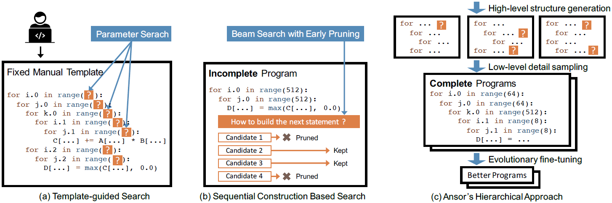
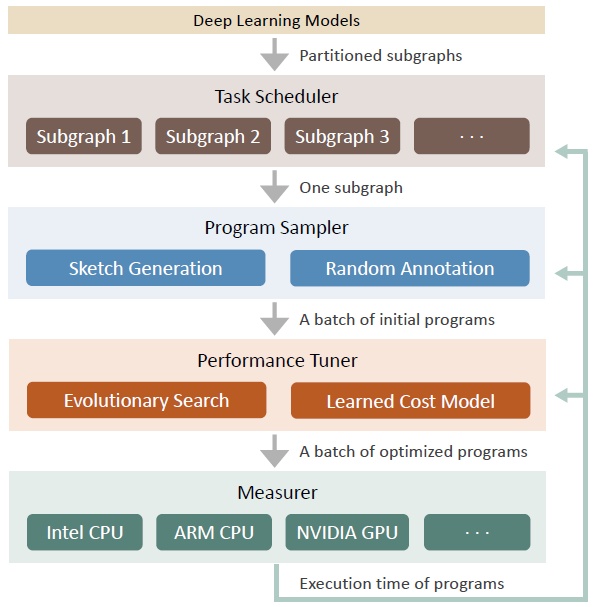
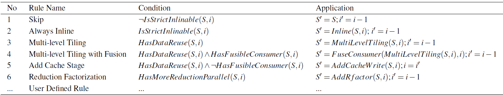
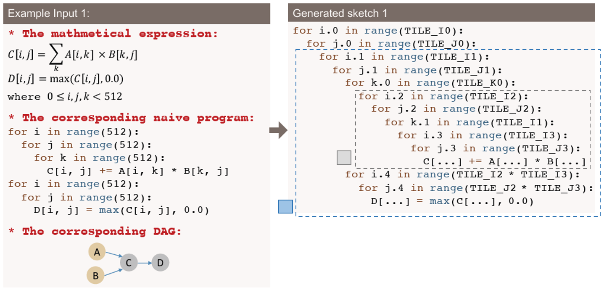
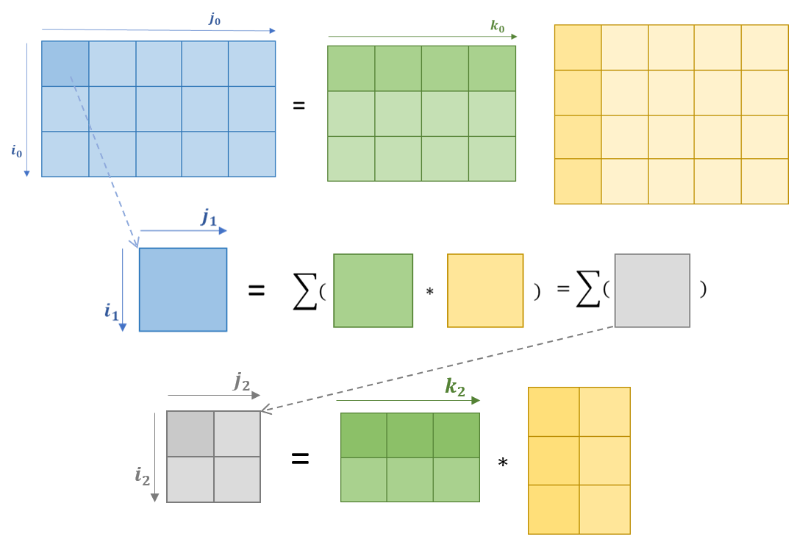

## Introduction

由于之前的工作均存在需要大量工程量开发平台特定优化代码，或者由于搜索空间以及较低效的搜索策略而无法找到高性能实现的问题，Ansor提出了一个针对Deep learing应用的张量程序生成框架。
Ansor通过在分层的搜索空间中抽取程序，探索了更多的优化组合，此外通过进化搜索和学好了的成本模型来fine-tune抽出的程序，从而决定最优程序。

当前编译的发展倾向于用户定义high-level声明式语言，编译器为不同硬件平台寻找优化的底层实现，因此一个足够大并能覆盖所有优化程序的搜索空间对该基于搜索的方法非常重要。作者认为之前的工作在这方面存在不足，它们一部分依赖于预定义的手工写好的模板(e.g., TVM, FlexTensor)，另一部分则在评估部分函数时就进行了过多的剪枝(e.g., Halide auto-scheduler)，因此都没有全面地覆盖搜索空间。

Ansor在实现中面临的三个主要挑战：

- 需要自动构建出一个能覆盖尽可能多的针对给定计算的tensor程序的搜索空间
- 在避免对比不完整程序的情况下，在一个比现存模板覆盖范围的量级大得多的空间内高效搜索
- 当优化一个含有众多子图的DNN时，应当识别出对端到端性能影响最大的子图

Ansor利用分层表示来覆盖整个搜索空间，通过将high-level结构与low-level的细节分离实现了高层结构的灵活列举与底层细节的有效采样。该搜索空间通过给定计算定义自动构建，随后Ansor从搜索空间中采样完整程序并通过进化搜索和学好的成本模型来fine-tune这些程序。

论文贡献如下：
- 提出对给定计算图生成分层张量程序搜索空间的机制
- 一个用来fine-tune的有学好的成本模型的进化策略
- 一种用于寻找关键子图的基于梯度下降的调度算法
- 通过评估论证了Ansor在各种DNN和硬件平台上效果比现存系统好

## Overview 

Ansor的整体架构可以表示如下：

Ansor使用算子融合将DNN模型从一些常用格式(e.g. ONNX)切分为子图，任务调度器基于梯度下降的调度算法为各个子图分配资源，采样器从搜索空间中随机采样，优化器进行fine-tune。

## Program Sampling

Ansor将搜索空间分为了**sketch**和**annotation**两层，其中high-level的程序结构称为sketch，底层选择(e.g., tile size, parallel, etc.)称为annotations。

### Sketch生成

Ansor提出了一个基于推导的枚举方式，通过递归应用一些基本规则生成所有可能的sketch。定义一个`state`为$\sigma = (S, i) $, 其中S是当前生成的部分sketch，i是节点在计算图中的拓扑排序编号，该拓扑排序从`output`向`input`编号。该推导过程从$\sigma = (naive\ program, last\ node)$开始，当`i`=0时结束，通过维护一个queue来存放所有中间状态。下图是CPU上的推导规则。

- `IsStrictInlinable(S,i)`: 表示S中的node i是element-wise算子，总是可以被直接内联(e.g., add,ReLU)
- `HasDataReuse(S,i)`:表示S中的node i是计算密集型算子，有大量的算子内数据重用机会(e.g., Conv2d, matmul)
- `HasFusibleConsumer(S,i)`:表示S中的node i只有一个消费者j，且j可以被融合进node i(e.g., matmul + bias_add, conv2d + relu)，即TVM中的reduction+element-wise
- `HasMoreReductionParallel(S,i)`:表示S中的node i在空间维度很难并行，但在reduction上有足够并行机会(e.g., computing 2-norm of a matrix, matmul $C_{2\times 2}=A_{2\times 512}\cdot B_{512\times 2}$) 

该分析通过切分数学表达式中的读写模式自动进行，对各个规则做简单解释：

rule1和2是字面意思，rule3，4和5对应多层次tiling以及含可重用数据的节点融合。对于rule3，其中`MultiLevelTile`在CPU上使用了`S`和`R`tile结构，其中`S`表示space loop的tile，`R`表示reduction loop的tile。以矩阵乘为例，`(i,k)*(k,j)`的矩阵乘中，`i`和`j`为space loop，`k`为reduction loop。Rule4除了多层次tiling还包括处理可融合消费者,例如，可以将element-wise节点融合进tiling节点。
下面是一个运用`MultiLevelTile`的例子，具体来说，这里是$rule1 \rightarrow rule4\rightarrow rule1 \rightarrow rule1$：

对应的tiling过程如下图所示：

Rule5则是在当前数据可重用节点没有可融合消费者的情况下添加caching节点。Rule6通过rfactor将reduction loop分解为space loop来提供更高的并行度。

### Random Annotation

通过sketch得到是不完整的程序，因为并没有指明tile大小，以及loop的一细节（如并行，展开，向量化等）。在这一阶段，从一系列生成的sketches中随机选取一个，随机填充tile大小、将外层循环并行、将内层循环向量化并展开少量内层循环。同时随机改变一些节点内的计算位置来对tile结构进行轻微改变。

### GPU支持

此时，将`SSRSRS`的tile结构变为`SSSRRSRS`来适应GPU架构，其中前三个space loop对应的是`blockidx`, `virtual thread`(为了减少bank冲突), `threadidx`。同时添加了两个类似于Rule5和Rule6的规则。

## TODO

fine-tune and task scheduler parts
