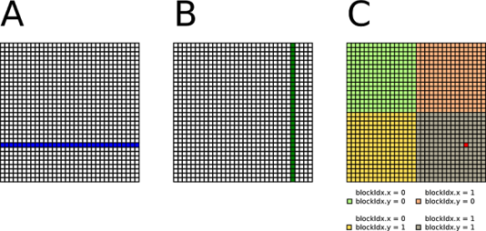
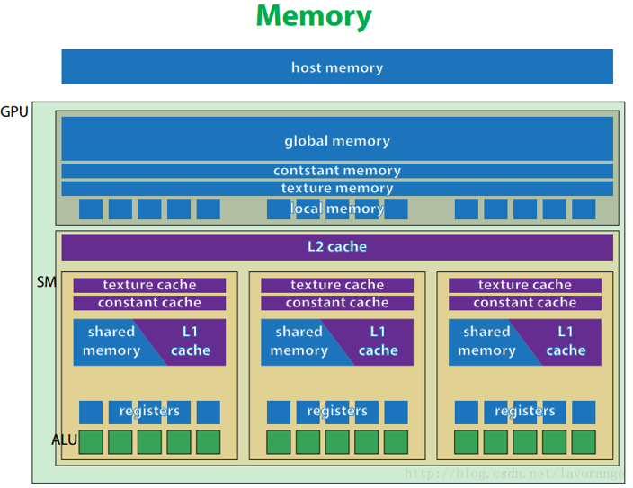
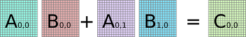
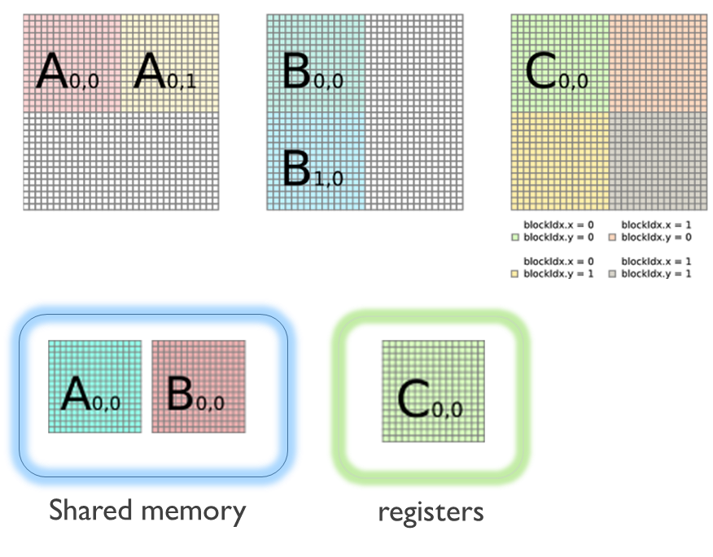
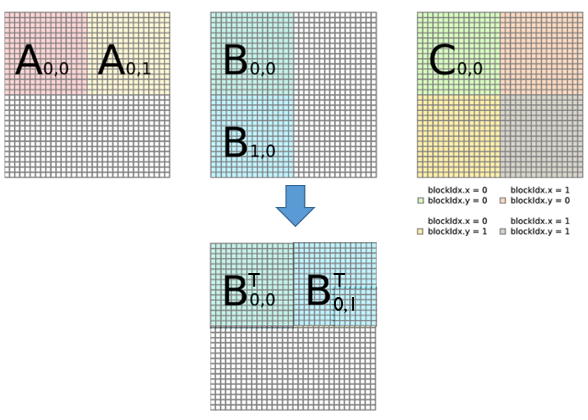
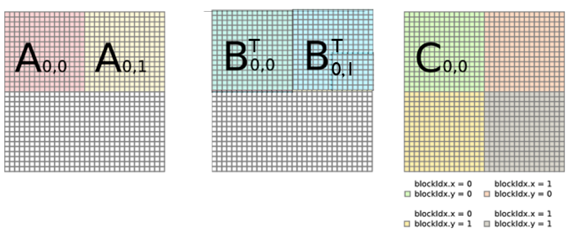
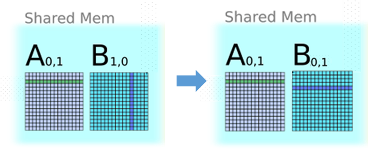

# Matmul Optimizations

矩阵乘法作为Deep Learning中的重要计算，通过其在cuda上的几种基本优化方式了解Deep Learning计算的优化方向。以下全部以两个正方形矩阵相乘的`kernel`写法为例。

> not finished, to be added

### Naive Implementation

```c++
__global__ void matrixMul(A, B, C, K){
    temp = 0;
    int i = blockIdx.y * blockDim.y + threadIdx.y ;
    int j = blockIdx.x * blockDim.x + threadIdx.x ;
    for(int k = 0; k< K – 1;k++) 
        accu += A[i][k] * B[k][j];
    C[i][j] = accu;
}
```

最简单的实现完全根据矩阵乘法公式进行，即对于每个$c_{i,j}$, 根据公式$c_{i,j}= \sum_k a_{i,k}*b_{k,j}$算出结果。具体来说，对于n\*n的两矩阵相乘，在cuda中需要启动n\*n个线程，每个线程调用一个kernel，该过程在global memory中的表示如下：

<div align="center"></div>


线程从GM中取出A矩阵的一行与B矩阵的一列，相乘累加后得到结果再存回GM。 

### Tiling

GPU存储结构的一个示意图如下：

<div align="center"></div>

由图，相对于计算单元，在访存速度上有$global\ memory < shared\ memory < register$。一般来说，shared memory为on-chip，而global memory为off-chip，以NVIDIA的系列某代GPU架构为例（这部分还没写），SM访存速度在GM的4~5倍。
在**计算访存比**(Compute-to-memory-access ratio)上，每一次乘加操作都对应从GM中取出$a_{i,k}, b_{k,j}$两个浮点数，由于计算速度远大于访存速度，因此ALU的实际利用率较低。
在这种情况下，**Tiling**通过利用 GPU 上的 shared memory 来减少对 global memory 的访问以提高效率。以原矩阵大小$\frac14$的tile为例：

```c++
__global__ void matrixMul(A, B, C, K){

    __shared__ float A_s(blockDim.y, blockDim.x);
    __shared__ float B_s(blockDim.x, blockDim.y);
    accu = 0;

    for(int tidx = 0; tidx < K/blockDim.x; tidx++){
        i = blockIdx.y * blockDim.y + threadIdx.y;
        j = tidx * blockDim.x + threadIdx.x;
        A_s[threadIdx.y][threadIdx.x] = A[i][j];  //加载到SM
        B_s(threadIdx.x][threadIdx.y] = B[j][i]; 
        __sync();
        for(int k = 0; k < threadDim.x; k++)
            accu += A_s[threadIdx.y][k] * B_s[k][threadIdx.x];
        __sync();
    }
    i = blockIdx.y * blockDim.y + threadIdx.y;
    j = blockIdx.x * blockDim.x + threadIdx.x;
    C[i][j] = accu;
}
```

该计算基于如下分块矩阵计算公式：

<div align="center"></div>

上图对应gpu中的一个block中进行的计算，在该被分片后的矩阵内，仍然是一个线程计算c矩阵中的一个元素。不同的是，在计算前先将子矩阵加载到shared memory中，如下图。

<div align="center"></div>


此时计算流程变为：
- 将$A_{0,0}, B_{0,0}$从global memory加载到shared memory
- 根据$A_{0,0}, B_{0,0}$计算出$C_{0,0}$的中间结果，将其存入register
- 将$A_{0,1}, B_{1,0}$从global memory加载到shared memory
- 根据矩阵乘公式与register中的中间结果累加
- 将register中的$C_{0,0}$结果写回global memory

同样对于n\*n的两矩阵相乘，在上述分割中只需要进行2\*2\*2\*2次global memory到shared memory的整块拷贝，以及2\*2\*2\*2\*$\frac{n}{2}$\*$\frac{n}{2}$次shared memory访存，从而提高了计算访存比。

### Global Memory Coalescing

```c++
__global__ void matrixMul(A, B, C, K){
    accu = 0;
    for(int tidx = 0; tidx < K/blockDim.x; tidx++){
        i = blockIdx.y * blockDim.y + threadIdx.y;
        j = tidx * blockDim.x + threadIdx.x;
        A_s[threadIdx.y][threadIdx.x] = A[i][j];
        B_s[threadIdx.x][threadIdx.y] = B[i][j]; 
        __sync();
        for(int k = 0; k < threadDim.x; k++)
	 accu += A_s[threadIdx.y][k] * B_s[threadIdx.x][k];
        __sync();
    }
    i = blockIdx.y * blockDim.y + threadIdx.y;
    j = blockIdx.x * blockDim.x + threadIdx.x;
    C[i][j] = accu;
}

```

<div align="center"></div>

### Avoid SM Bank Conflict

```c++
__global__ void matrixMul(A, B, C, K){
    accu = 0;
    for(int tidx = 0; tidx < K/blockDim.x; tidx++){
        i = blockIdx.y * blockDim.y + threadIdx.y;
        j = tidx * blockDim.x + threadIdx.x;
        A_s[threadIdx.y][threadIdx.x] = A[i][j];
        B_s[threadIdx.y][threadIdx.x] = B[i][j]; 
        __sync();
        for(int k = 0; k < threadDim.x; k++)
	 accu += A_s[threadIdx.y][k] * B_s[k][threadIdx.x];
        __sync();
    }
    i = blockIdx.y * blockDim.y + threadIdx.y;
    j = blockIdx.x * blockDim.x + threadIdx.x;
    C[i][j] = accu;
}

```

<div align="center"></div>

<div align="center"></div>