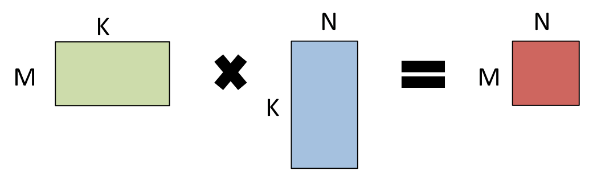
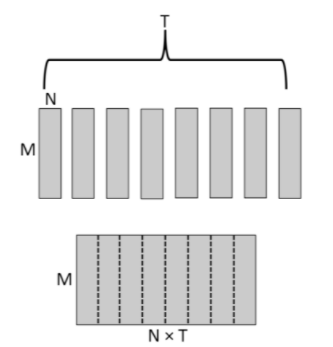

# Optimizing RNN performance

This blog focus on GEMM operations.

## Background

### From NN to BLAS

- M = the number of outputs
- K = the number of inputs
- N = the size of the minibatch

For a forward looks like  , the  is `(M, K)`, the vector-like  is `(K, N)`.

To map NN to BLAS, use the following variants of GEMM:
- `NN` : the forward-pass multiplications  and 
- `TN`: the backward-pass multiplications  and 
- `NT`: the update calculations  and 

### Mini-batch size

The performance of GEMM will not monotonically increase with batch size as expected due to hardware constraints and specific implementation.

The upper bound of a mini-batch size is determined by `seq_len`, available memory, the memory allocator, and the data type used to store activations.

- if `seq_len` is too long, activations are too much for GPU memory, it will fall back to **host-paged memory**(on host, but addressable from device). 

## Methods

### Combine across time 

Because  is time-independent, those multiplications during a timescale can be combined into a larger one. **Put the matrixs that adjacent in time together in memory** then results in a larger matrix as follows.

### Use multpiles of 32

Use tensors having every dimension of 32x to utilize the warps.

### Take advantages of NN vs TN asymmetry

Transpose the matrixs to use the faster op between NN and TN ops.

### Small mini-batches

- For hindrance to increasing parallelism when mini-batch decreasing, the **drop in performance of matmul >  the increase in communication cost** for synchronizing the weight updates.
  - write a custom kernel to speedup
